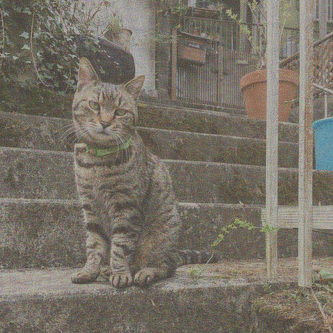
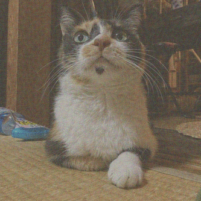

TensorFlow-StyleTransfer
==============================

Style transfer written in TensorFlow

  +  = 

  +  = 

## Prerequisites

* Python 3.x - Highly recommended installed by [pyenv](https://github.com/pyenv/pyenv) and [anaconda](https://www.continuum.io/downloads).
* TensorFlow

## Usage

```
$ make run OPTIONS='--content=yuzu --iter=300'
```

## Viasualizing

```
$ tensorboard --logdir=graphs/style_transfer
```


# References

* [CS20SI](http://web.stanford.edu/class/cs20si/syllabus.html)
* [Style Transfer](https://github.com/fzliu/style-transfer)
* VERY DEEP CONVOLUTIONAL NETWORKS FOR LARGE-SCALE IMAGE RECOGNITION - [https://arxiv.org/pdf/1409.1556.pdf](https://arxiv.org/pdf/1409.1556.pdf)
* A Neural Algorithm of Artistic Style - [https://arxiv.org/abs/1508.06576](https://arxiv.org/abs/1508.06576)

<p><small>Project based on the <a target="_blank" href="https://drivendata.github.io/cookiecutter-data-science/">cookiecutter data science project template</a>. #cookiecutterdatascience</small></p>
